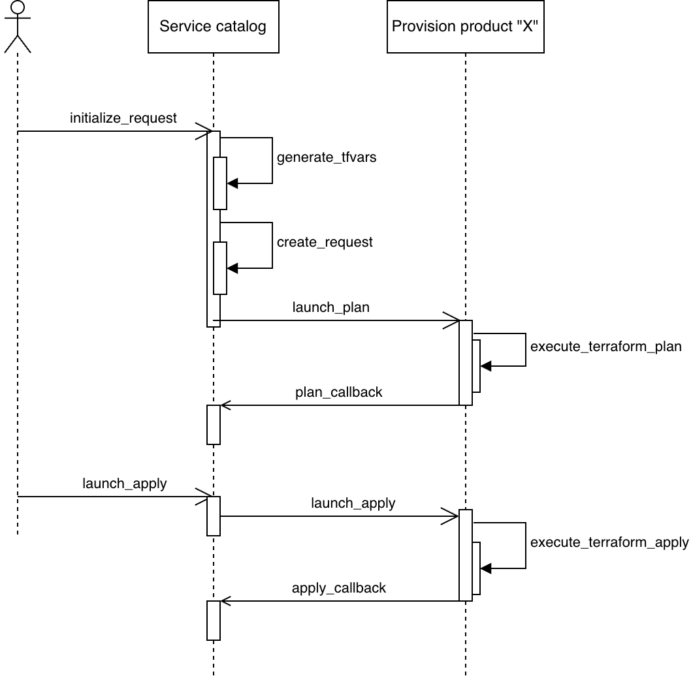

# Service catalog repository
This repository contains the workflows and script used to provision new resources within GCP.

The aim is to have a single entry point for operators to provision new demands, whether it concerns the creation of a resource, a resource update, a decommissioning... or other cases.

## Workflows

- **intialize_request.yaml**:
  - event: this workflow is manually triggered through the web UI or a Rest API call.
  - purpose: based on the inputs provided by an operator, the workflow generates some tfvars content, and creates a request to follow the progress (for now, a Github issue). The generated tfvars is then sent to another workflow, located in another repository dedicated to the provisioning of a specific asset type (e.g VMs, GKE clusters...).
- **plan_callback.yaml**:
  - event: this workflow is called by the workflow executing the *terraform plan*, once the plan execution is over.
  - purpose: this workflow updates the request status depending on whether the plan succeeded or failed, or if no changes were detected by terraform. In case of success, the plan is shown within the request, and instructions to launch the apply phase are added to the request.
- **launch_apply.yaml**:
  - event: temporarily and for testing purpose, this workflow is triggered when a comment is added to the request. In the target design, this workflow is triggered but pending review during the plan_callback workflow execution, if the plan in question succeeded.
  - purpose: this workflow orders the launch of the *terraform apply*, based on the request content and a specific plan run id for which we want *terraform apply* to be executed.
- **apply_callback**:
  - event: this workflow is called by the workflow executing the *terraform apply*, once the apply execution is over.
  - purpose: this workflow updates the request status depending on whether the apply succeeded or failed. It adds a comment specifiying the apply status and including the apply logs, or a link to those logs (TODO: include apply logs). The request is closed in case the apply was successful.

## Scripts
- transition_guard.py: this script is used to ensure the requests status remain consistent after each request update.
