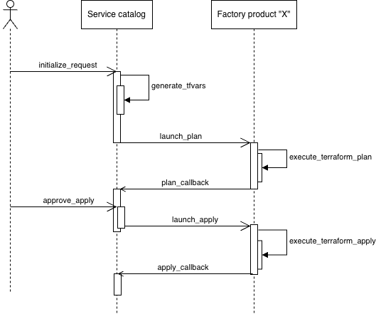

# Service catalog repository
This repository contains the workflows used to provision new resources within GCP.

The aim is to have a single entry point for operators to provision new demands, whether it concerns the creation of a resource, a resource update, a decommissioning... or other cases.

## Workflows

- **intialize_request.yaml**:
  - event: this workflow is manually triggered through the web UI or a Rest API call.
  - purpose: based on the inputs provided by an operator, the workflow generates some tfvars content (TBD - out of scope). The generated tfvars is then sent to another workflow, located in another repository dedicated to the provisioning of a specific asset type (e.g VMs, GKE clusters...).
- **plan_callback.yaml**:
  - event: this workflow is called by the workflow executing the *terraform plan*, once the plan execution is over.
  - purpose: this workflow displays a summary of the _terraform plan_ execution, then creates a job **to be approved for launch** for the _terraform apply_ execution.
- **apply_callback**:
  - event: this workflow is called by the workflow executing the *terraform apply*, once the apply execution is over.
  - purpose: this workflow displays a summary of the _terraform apply_ execution.

## Prerequisites
- Service catalog repository:
  Repository variables:
    - TF_BACKEND_STATE: object storage containing the tfvars file to upload
    - WIF_POOL_NAME: pool name
    - WIF_PROJECT_NB: pool's project number
    - WIF_PROVIDER_NAME: provider name
    - WIF_SERVICE_ACCOUNT_EMAIL: service account the runner uses for authentication
    - SERVICE_CATALOG_GHA_CLIENT_ID: Github App client ID
  Repository secrets:
    - service_catalog_githubapp_private_key: Github App private key
